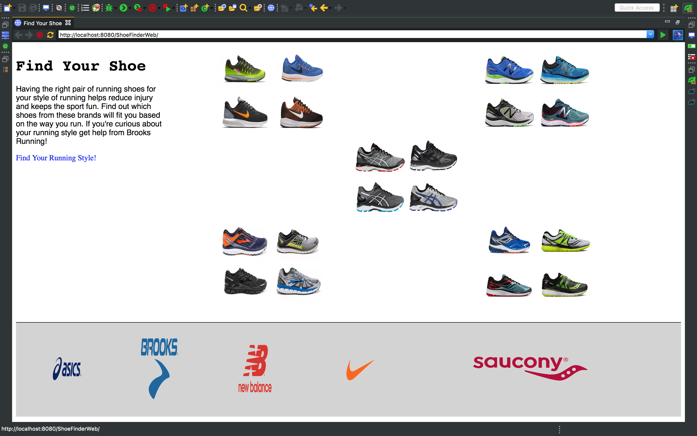
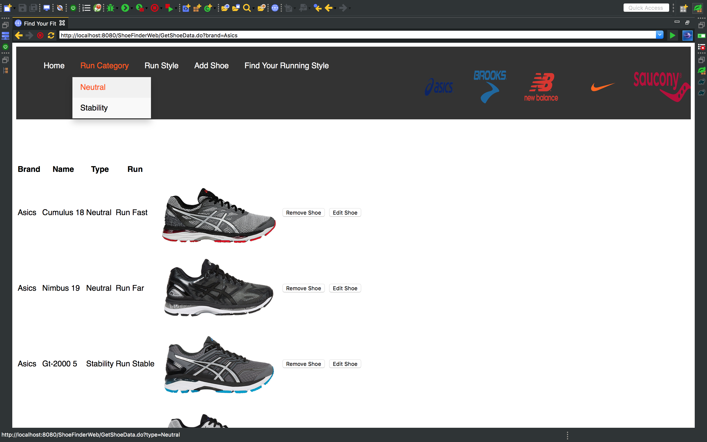

#Summary
A Java web-app developed on eclipse using the Spring Tool Suite which allows users to utilize CRUD operations on a shoe list.

## In This Document
1. [How to Execute](#how-to-execute)

## How to Execute
- The web-app is hosted on: insert URL <a href="http://52.43.150.156:8080/PresidentsWeb/">**here**</a>
- Download the entire program as a .war file <a href="PresidentsWeb.war">**here**</a>

## Instructions
1. User arrives on landing page.
2. User can  follow link to Brooks Running for general information on running style.
3. User can click on a logo of the shoe brands located in the footer to see a list of shoes
4. Information is displayed on the given brand:
  - Run Fast neutral shoes made for "everyday runs"
  - Run Far Neutral shoes made for longer runs, usually more than 12 miles.
  - Run Stable Stability shoes made to correct over-pronation, the inward roll of the ankles during stress.
  - Run True Stability shoes made to correct over-pronation during longer runs.
5. User has the ability to  see CRUD operations in use by:
  - Removing shoes form list.
  - Editing a shoe on the list.
  - Adding a new shoe to the list.
6. User can also click on the drop down menu to filter shoes by:

   - Category
     - Neutral
     - Stability
   - Run Style
     - Run Fast
     - Run Far
     - Run Stable
     - Run True
